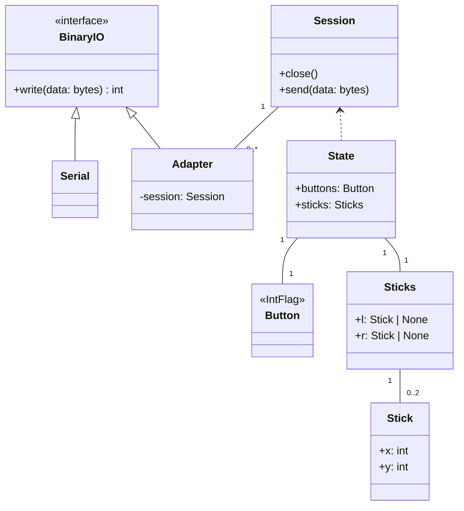

# BluetoothAdapter

Poke-Controller MODIFIED向けBluetooth自動化

> Windowsでしか動作を確認していませんが、原理としては可能なはずです。*nixへの移植はアカツキさんが取り組んでいることを把握しています。

## Requirements

### [btkeyLib.dll](https://note.com/gamewagashi/n/n4a76066320e9)

ダウンロードして、`bluetooth/btkeyLib/`に配置してください。

### Zadig

ドライバをWinUSBに置き換えます。もろもろ自己責任でお願いします。

ドングルについては、[CSR8510 A10が推奨チップ](https://twitter.com/AT12806379/status/1597938264069263360)です。具体的には[ELECOM LBT-UAN05C2/N](https://www.elecom.co.jp/products/LBT-UAN05C2N.html)で動作を確認しましたが、このドングルであれば必ず成功することを保証するものではありません。

### com0com

導入は[こちら](https://qiita.com/yaju/items/e5818c99857883a59033)の解説を確認してください。

## Usage

PokeConのシリアルポートを仮想シリアルポートドライバ（例：[com0com](https://qiita.com/yaju/items/e5818c99857883a59033)）に設定して、`serial.cfg`に対となるポートを設定してください。

```ini
[Serial]
port = COM6
baudrate = 4800
```

PythonコマンドをBluetoothで実行する場合、doメソッドに`bluetooth`デコレーターを付与します。

```python
from __future__ import annotations

from Commands.Keys import Button
from Commands.PythonCommandBase import ImageProcPythonCommand

from pokecon_extensions.bluetooth import bluetooth


_config = {
    "config": {
        "port": "COM6",
        "baudrate": 4800
    },
    "timeout": 30
}


class BluetoothAdapter(ImageProcPythonCommand):

    NAME = "Bluetooth自動化のテスト"

    def __init__(self, cam):
        super().__init__(cam)

    @bluetooth(**_config)
    def do(self):
        self.press(Button.A, 1, 1)
        self.press(Button.A, 1, 1)

```

## Diagram

主軸となる`Adapter`は`Serial`同様`BinaryIO`（`write`メソッドなど）を実装しており、将来的にPokeConに組み込む際に置き換えが簡単になるようにしています。



## Acknowledgments

DLL author: みずようかん ([@AT12806379](https://twitter.com/AT12806379))

Port to *nix: アカツキ ([@pokemium](https://twitter.com/pokemium))
